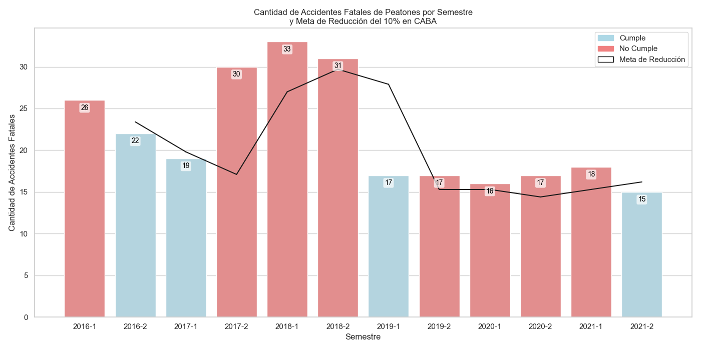

# Análisis Exploratorio de Datos (EDA) sobre Siniestros Viales en la Ciudad Autónoma de Buenos Aires (CABA) durante el periodo de 2016 a 2021

### Introducción

**Este informe presenta un Análisis Exploratorio de Datos (EDA)** sobre una base de datos de siniestros viales con víctimas fatales en la Ciudad Autónoma de Buenos Aires desde 2016 hasta 2021. El análisis proporciona una visión general de los datos, destacando patrones y hallazgos clave, con un enfoque particular en la distribución espacial mediante diversos mapas y filtros que describen perfiles de víctimas y periodos de tiempo. 

### 1. Preparación y Limpieza del Dataset

**1.1 Carga del Dataset**

- La base de datos se obtuvo del archivo `homicidios.xlsx`, que incluye información sobre los incidentes (`homicidios_raw`) y las víctimas (`victimas_raw`).
- La exploración inicial incluyó la verificación de nombres de columnas, tipos de datos y valores faltantes.

**1.2 Limpieza de Datos**

- Los campos temporales (por ejemplo, fechas y horas) se convirtieron a formatos apropiados.
- Las coordenadas geográficas se limpiaron y convirtieron a tipos numéricos.
- Se identificaron y trataron los valores faltantes según corresponda.
- Se analizaron valores repetidos de la variable ID y ID_hechos del dataset. No se aplicó ningun tratamiento.

<u>**Hallazgos:**</u>

- Los campos geográficos clave (`pos x`, `pos y`) tenían muy pocos valores faltantes (~0.4%).
- Los campos relacionados con direcciones tenían una cantidad significativa de datos faltantes, indicando una información incompleta en muchos registros.
- Los valores repetidos se encontraron en la hoja de VICTIMAS y se interpretan como registros de múltiples víctimas del mismo evento o siniestro.

### 2. Estadísticas Descriptivas de Variables Numéricas

**2.1 Valores Máximos y Mínimos y análisis de frecuencias**

- Los incidentes anuales alcanzaron su pico en 2018 con 142 incidentes y disminuyeron a un mínimo en 2020 con 78 incidentes.
- Diciembre fue el mes con mayor cantidad de incidentes (77) en toda la serie de tiempo, mientras que septiembre tuvo la menor cantidad (47).
- Los patrones semanales mostraron poca variación, con un ligero aumento los lunes (106 incidentes) y una ligera disminución los jueves (94 incidentes).
- Los incidentes por hora alcanzaron su pico entre las 5 am y las 7 am, siendo las 6 am la hora con mayor cantidad de incidentes (40) y las 2 am la hora con menor cantidad (17).

### 3. Distribución Espacial de los Incidentes

**3.1 Mapas de Distribución de Incidentes**

- Se generaron mapas utilizando `folium` para visualizar las ubicaciones de los incidentes basados en coordenadas.
- Un mapa de calor destacó las áreas con alta concentración de incidentes.

**Hallazgos:**

    Se identificaron altas concentraciones de incidentes en áreas como Liniers, Flores, Constitución y Balvanera.

Estos puntos críticos podrían estar relacionados con áreas de alto tráfico y cruces peligrosos, sugiriendo la necesidad de intervenciones en seguridad vial en estos lugares.

**3.2 Análisis por Tipos de Calles**

- Se crearon tablas de frecuencia para los tipos de calles y nombres de calles específicas con altos incidentes.
- Un análisis de Pareto mostró que un pequeño número de calles representaba una porción significativa de los incidentes.

**Visualización:**

La mayoría de los incidentes ocurrieron en avenidas, seguidas por calles y autopistas. Calles específicas como "PAZ, GRAL. AV." y "RIVADAVIA AV." presentaron un número notablemente alto de incidentes, lo que indica la necesidad de medidas específicas en estas vías.

### 4. Análisis por Tipos de Involucrados

**4.1 Frecuencias de Víctimas y Acusados**

- Se analizaron las distribuciones de frecuencia para los tipos de víctimas, acusados y participantes en los incidentes.
- Los motociclistas y peatones fueron las víctimas más comunes, mientras que los ocupantes de vehículos privados y transportes públicos fueron a menudo los acusados.

### 5. Exploración del Perfil de las Víctimas**

- Se realizó un análisis detallado de los perfiles de las víctimas, incluyendo edad, género y rol (por ejemplo, conductor, pasajero).
- Las gráficas mostraron que la mayoría de las víctimas eran hombres entre 20 y 40 años, principalmente motociclistas y peatones.
- La distribución de edades mostró que las víctimas femeninas tenían un rango más amplio, con algunos *outliers* mayores de 83 años, mientras que las víctimas masculinas tenían un rango de edades más centrado.
- Los peatones tienen un patrón de edades que se diferencía claramente del de los conductores, mostrando mayores frecuencias en rangos de edades mayores (alrededor de los 37 y 73 años).

**Hallazgos:**

La mayoría de las víctimas masculinas eran jóvenes adultos, mientras que las víctimas femeninas tenían una distribución de edad más variada. Los datos sugieren que las intervenciones de seguridad vial deberían enfocarse en motociclistas y peatones, especialmente en jóvenes adultos. Además, cada perfil de víctima también muestra una distribución espacial diferenciada.

### 6. Exploración de la distribución espacial de siniestros por distintos momentos del día

- Se analizó la distribución de los siniestros en la ciudad durante distintos momentos del día (mañana, tarde y noche).

  **Hallazgos:**
  La mayor concentración de siniestros siempre se ubica en la zona central de la ciudad, sin embargo, se observan algunas variaciones hacia la periferia dependiento del momento del día.
  

  ### 7. Análisi de KPI's

  -Se calcularon tres KPI's:
  1. Reducir en un 10% la tasa de homicidios en siniestros viales de los últimos seis meses en CABA, respecto a la tasa de homicidios del semestre anterior
  2. Reducir en 7% la cantidad de accidentes mortales de motociclistas en el último año, en CABA, respecto al año anterior
  3. Disminuir en un 10% las víctimas fatales PEATONES en CABA, respecto al semestre anterior

  **Hallazgos:**

  KPI 1: En primeros años (2016 a 2018) solo se cumplió la meta en el semestre 2017-1, posteriormente se alcanzaron las metas hasta 2020-2, momento en que empezó a incrementar la cantidad de siniestros por habitante, por lo cual se dejó de cumplir hasta 2021-2.
  KPI 2: Este KPI ha tenido un comportamiento irregurar, no siempre se han cumplido las metas aunque se observa que los accidentes mortales de motociclistas han disminuido consistentemente.
  KPI 3: Hay comportamiento peculiar en el cual se aumentaron los sinietros con víctimas mortales peatones durante 2017 a 2018 para después reducir drásticamente las cifras, sin embargo, a partir de 2019 solo se ha cumplido la meta en dos periodos (2019-1 y 2021-2).
  
  
  
  
### Conclusión

Este EDA revela hallazgos críticos sobre los patrones y distribuciones de siniestros viales fatales en Buenos Aires desde 2016 hasta 2021. El análisis enfatiza la importancia de los factores espaciales y temporales, así como los perfiles de los involucrados. Estos hallazgos pueden informar intervenciones dirigidas y la formulación de políticas para mejorar la seguridad vial. Se sugiere ahondar en la caracterización de los perfiles de las víctimas con el fin de ofrecer una mayor protección y prevención de accidentes mediante la mejora en la infraestructura y equipamiento de la ciudad así como de la educación vial enfocada a cada uno de los perfiles definidos.
